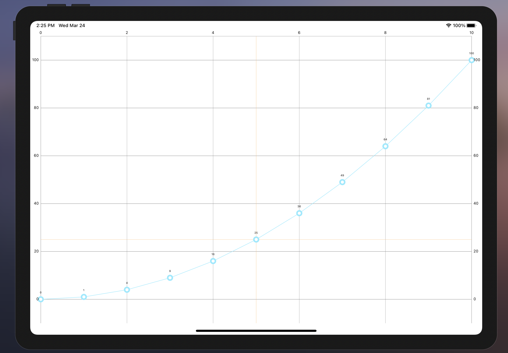
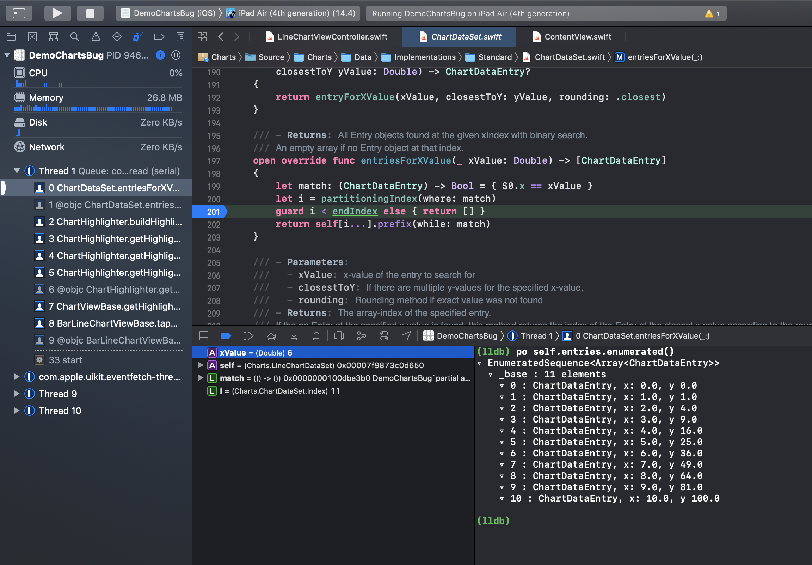

# Charts - Highlighting Selection Bug

**Actions Taken**

* Run the app on simulator iPad Air (4th Generation) 14.4
* Tap various points along the chart

**Expected Result**

* The entry closest to the tap point should be highlighted

**Actual Result**

* The majority of the time no entry is highlighted even after tapping all around the chart
* Rarely an entry actually is highlighted but given hightlighting fails the majority of the time the overall behavior is very poor

_**Figure 1**: The chart that is rendered when this project is run_

----

## Technical Details

Figure 2 shows a stack trace which highlights the problem area.

This stack trace was generated by tapping a point just after the 5th chart entry.

In the debug window it can be seen that the variable `i` is set to `11` indicating the `partitionIndex` func did not correctly find the index of the first item that matches the predicate on line 199.

Given the argument `xValue` having value `6` the expected return for `i` should be `6`.

The values contained within the `ChartDataSet`, along with their indexes, are printed in the bottom right of figure 2.

_**Figure 2**: Call stack showing where filtering goes wrong_